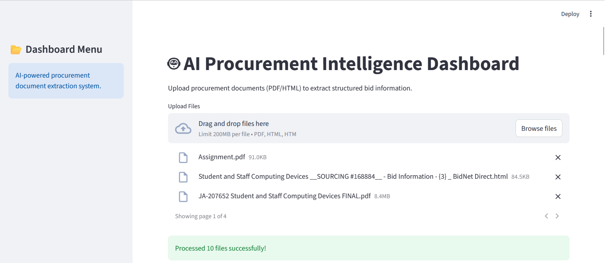
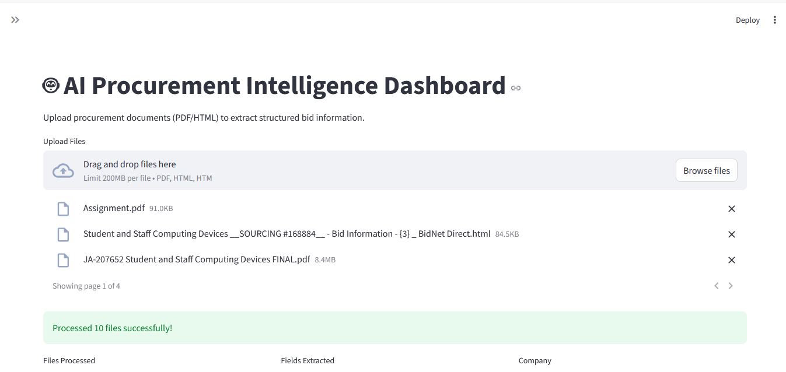
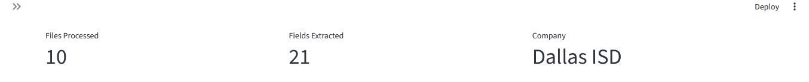
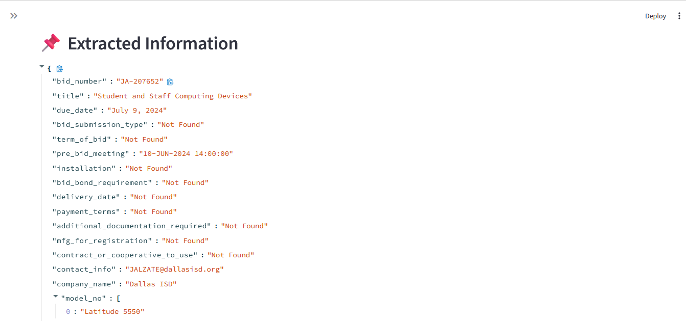
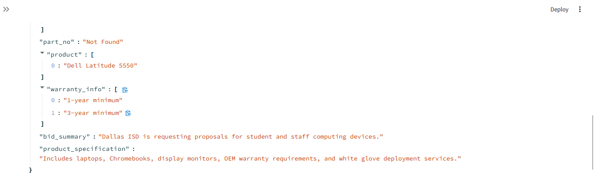
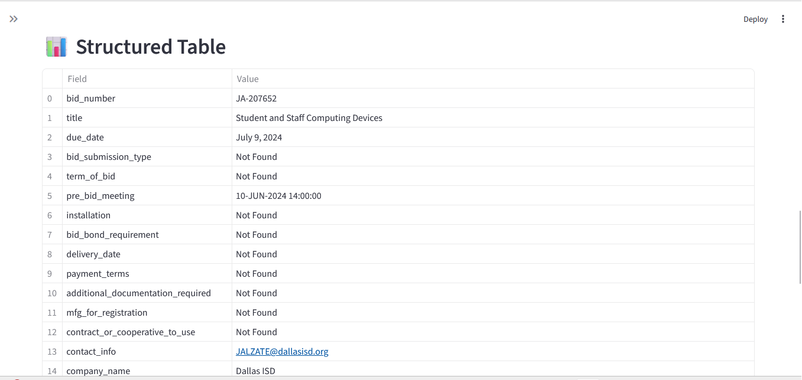
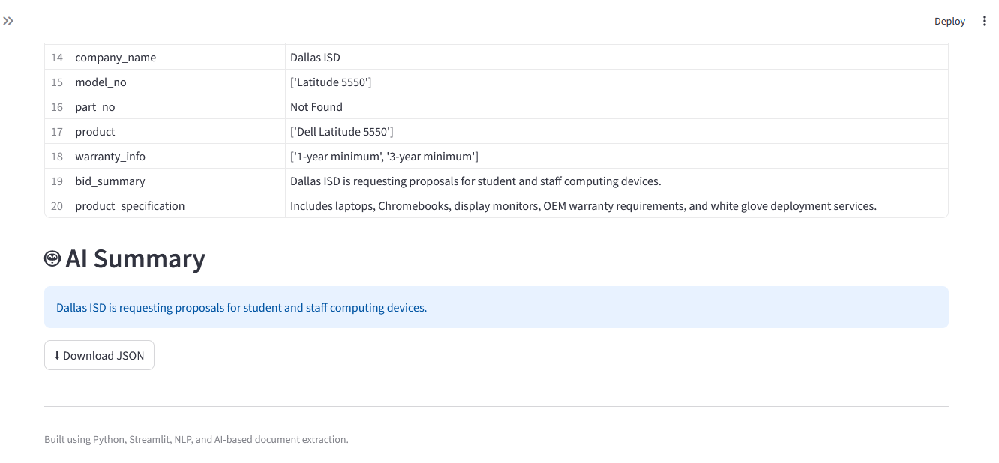
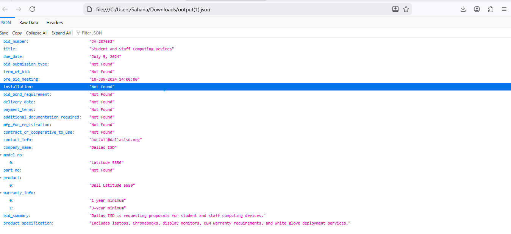

# 🤖 AI RFP Extraction System


An AI-powered document intelligence system that extracts structured procurement and Request for Proposal (RFP) information from PDF and HTML documents.

The system processes procurement-related files, extracts important bid information, and converts the extracted content into structured JSON output through an intelligent extraction pipeline.

Additionally, the project includes an interactive Streamlit dashboard for uploading files, visualizing extracted information, and downloading structured outputs.


# 🚀 Features

## 📄 Multi-Format Document Processing

- PDF parsing using PyMuPDF
- HTML parsing using BeautifulSoup
- Multi-file upload support
- Automated text extraction


## 📌 Structured Information Extraction

The system extracts procurement-related fields such as:

- Bid Number
- Title
- Due Date
- Bid Submission Type	
- Term of Bid	
- Pre Bid Meeting
- Installation
- Bid Bond Requirement
- Delivery Date
- Payment Terms
- Any Additional Documentation Required
- MFG for Registration
- Contract or Cooperative to use	
- Model_no	 
- Part_no	 
- Product	 
- contact_info	 
- company_name	 
- Bid Summary	 
- Product Specification	

 
## 🌐 Interactive Dashboard

Built using Streamlit.

Features include:

- Multi-file upload
- JSON visualization
- Structured table view
- Dashboard metrics
- Downloadable JSON output


# ⚙️ How It Works

1. Users upload procurement documents (PDF/HTML)
2. The system extracts raw text from the documents
3. Regex and parsing logic identify structured bid information
4. Extracted fields are converted into JSON format
5. The Streamlit dashboard visualizes the extracted data
6. Users can download the structured JSON output


# 🏗️ System Architecture

text
PDF / HTML Documents
          ↓
     Text Extraction
          ↓
 Structured Data Extraction
          ↓
      JSON Generation
          ↓
 Streamlit Dashboard Interface


# 📁 Project Structure

text
rfp_extractor_project/
│
├── data/
├── output/
│   └── output.json
│
├── screenshots/
│
├── src/
│   ├── extractor.py
│   ├── html_parser.py
│   ├── llm_processor.py
│   └── pdf_parser.py
│
├── dashboard.py
├── main.py
├── README.md
├── requirements.txt
├── .gitignore
└── .env


# 🛠️ Technologies Used

## Backend & Processing

* Python
* Regex (re)
* JSON

## Document Parsing

* PyMuPDF
* BeautifulSoup4
* lxml

## AI / NLP

* Google Gemini API
* AI-ready extraction pipeline

## Dashboard

* Streamlit


# ⚙️ Installation

## 1️⃣ Clone Repository

```bash
git clone https://github.com/SahanaAnthony/ai-rfp-extraction-system.git
```


## 2️⃣ Navigate to Project Folder

```bash
cd ai-rfp-extraction-system
```


## 3️⃣ Install Dependencies

```bash
pip install -r requirements.txt
```

---

# 🔑 Optional AI Integration

The project architecture supports LLM integration for AI-based summarization and semantic extraction.

To enable Gemini API support:

```text
GEMINI_API_KEY=your_api_key_here
```

---

# ▶️ Run the Extraction Script

```bash
python main.py
```

The extracted structured information will be saved to:

```text
output/output.json
```


# 🌐 Run the Dashboard

```bash
streamlit run dashboard.py
```


# 📊 Sample Extracted Output

```json
{
    "metadata": {
        "bid_number": "JA-207652",
        "title": "Student and Staff Computing Devices",
        "due_date": "July 9, 2024",
        "bid_submission_type": "Not Found",
        "term_of_bid": "Not Found",
        "pre_bid_meeting": "10-JUN-2024 14:00:00",
        "installation": "Not Found",
        "bid_bond_requirement": "Not Found",
        "delivery_date": "Not Found",
        "payment_terms": "Not Found",
        "additional_documentation_required": "Not Found",
        "mfg_for_registration": "Not Found",
        "contract_or_cooperative_to_use": "Not Found",
        "contact_info": "JALZATE@dallasisd.org",
        "company_name": "Dallas ISD",
        "model_no": [
            "Latitude 5550"
        ],
        "part_no": "Not Found",
        "product": [
            "Dell Latitude 5550"
        ],
        "warranty_info": [
            "3-year minimum",
            "1-year minimum"
        ],
        "bid_summary": "Dallas ISD is requesting proposals for student and staff computing devices.",
        "product_specification": "Includes laptops, Chromebooks, display monitors, OEM warranty requirements, and white glove deployment services."
    },
    "ai_summary": "\nAI summary could not be generated because the free-tier LLM API quota was exceeded.\n\nThe application architecture successfully supports LLM integration and can generate procurement summaries when API quota is available.\n"
}
```


# 📸 Dashboard Preview

## Dashboard Home



---

## Extracted Information View









---

## Structured Data Table



---

# 🧠 Engineering Design Decisions

## Hybrid Extraction Strategy

The project combines:

* Regex-based structured extraction
* AI-ready modular architecture
* Flexible document parsing

This approach improves:

* Reliability
* Maintainability
* Extensibility
* Error handling

---

## Precision Over Incorrect Extraction

Low-confidence fields intentionally return:

```text
Not Found
```

instead of generating unreliable outputs.

This improves extraction trustworthiness and system reliability.

---

# 🔒 Error Handling

The system includes graceful fallback handling for:

* Unsupported file formats
* Missing fields
* API quota limitations
* LLM integration failures

This ensures stable extraction even when AI services are unavailable.

---

# 🚀 Future Improvements

Potential future enhancements include:

* OCR support for scanned PDFs
* Advanced NLP entity extraction
* Confidence scoring
* RAG-based procurement intelligence
* Database integration
* Cloud deployment

---

# 💡 Key Learning Outcomes

This project demonstrates:

* AI-assisted document intelligence
* Multi-format document parsing
* Structured information extraction
* Dashboard development
* Modular software engineering
* Error-resilient AI architecture

---

# 👩‍💻 Author

Sahana A

Aspiring AI Engineer passionate about NLP, automation, and intelligent document processing systems.

```
```
